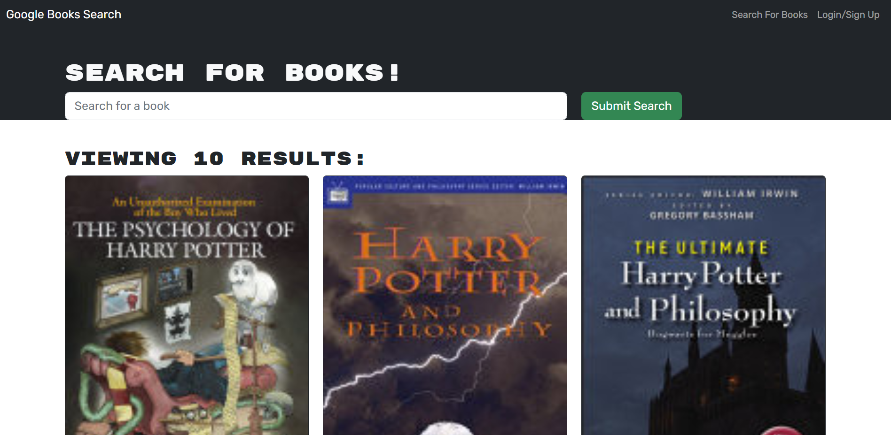

# Book Search Engine

## Description
I took a fully functioning Google Books API search engine built with a RESTful API and refactored it to be a GraphQL API built with Apollo Server. The app was built using the MERN stack, with a React front end, MongoDB database, and Node.js/Express.js server and API.

## Table of Contents
- [Description](#description)
- [Installation](#installation)
- [Usage](#usage)
- [Contributing](#contributing)
- [Questions](#questions)

## Installation
In order to install, please use:  
npm install

## Usage
As an avid reader, I want to search for new books to read so that I can keep a list of books to purchase.

The application will be invoked by using the following command: 
npm run build
npm run develop

## Contributing
Thank you for your interest in my project. I am excited to see your contributions. Please follow the [Contributor Covenant](https://www.contributor-covenant.org/).

## Questions
If you have additional questions, please email me at bsimmonds28@gmail.com.
To see more of my work, find me on GitHub at [bsimmonds28](https://github.com/bsimmonds28)!